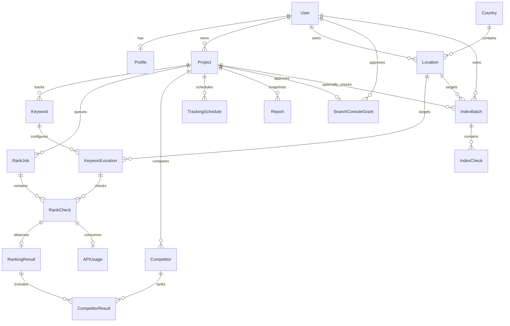

# Er Diagram

The planned ER model is below. Implemented relationships are tracked in DATABASE_RELATIONSHIPS.md.

```mermaid
erDiagram
 User ||--o| Profile : has
 User ||--o{ Project : owns
 User ||--o{ Location : owns
 Country ||--o{ Location : contains
 Project ||--o{ Keyword : tracks
 Keyword ||--o{ KeywordLocation : configures
 Location ||--o{ KeywordLocation : targets
 Project ||--o{ RankJob : queues
 RankJob ||--o{ RankCheck : contains
 KeywordLocation ||--o{ RankCheck : checks
 RankCheck ||--o| RankingResult : observes
 Project ||--o{ Competitor : compares
 RankingResult ||--o{ CompetitorResult : includes
 Competitor ||--o{ CompetitorResult : ranks
 RankCheck ||--o| APIUsage : consumes
 Project ||--o{ TrackingSchedule : schedules
 Project ||--o{ Report : snapshots
 Project ||--o| SearchConsoleGrant : approves
 User ||--o{ SearchConsoleGrant : approves
 User ||--o{ IndexBatch : owns
 Project ||--o{ IndexBatch : optionally_checks
 Location ||--o{ IndexBatch : targets
 IndexBatch ||--o{ IndexCheck : contains
```
